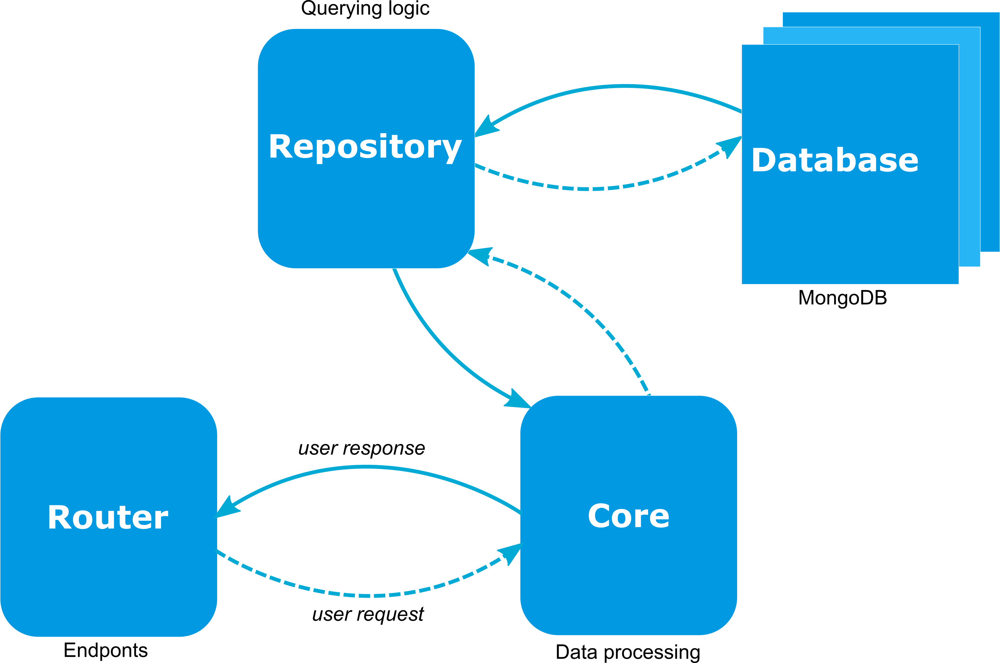
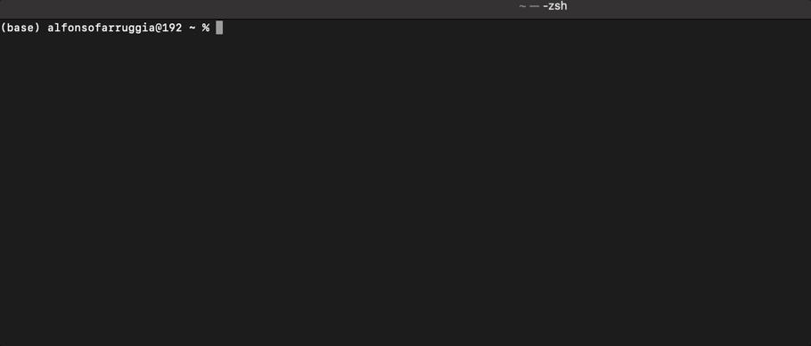

<div align="center">
  
</div>

<div align="center">
  ⚙ <strong>A command line tool to deploy python Rest APIS in 20 secs.</strong> ⚙
</div>
<br/>

<p align="center">
  
  <a target="_blank" rel="noopener noreferrer" href="https://github.com/Arfius/apijet/actions/workflows/apijet.yml/badge.svg">
    
  </a>

  <a target="_blank"  href="https://twitter.com/alfarruggia">
    
  </a>
</p>

<p align="center">
  <br/>
  <a style="{text-decoration: none;} " target="_blank"  href="https://medium.com/p/de089348c498"> 🔗 Example of a backend for a TODO app </a>
</p>

---

Apijet is a Python framework for building APIs via command line.

You will be able to deploy endpoints following these 5 steps:

1. **Install apijet**
```
$> python -m pip install apijet
```
2. **Create a project**
```
$> apijet create --name my_projet --port 9090 --address 127.0.0.1
$> cd my_projet
```
3. **Add and endpoint.**
The endpoint can also need database support, in this case, you pass the **--database** parameter.
```
$> apijet endpoint --name my_endpoint
```
4. **Run the server**
```
$> python my_projet/app.py
```
5. **Open your browser @ http://127.0.0.1:9090/docs**

These steps generates a project folder 

## Source code and pattern.

Apijet project folder contains the auto-generated python code. The code is arranged in four folders: core, repository, router and models. When a new endpoint is added, a new file in each of these four folders is created. These four files have the same name of the endpoint but they have different behaviour, see the following pattern.

<div align="center">
  
</div>

#### Router 
Files created as routers expose the endpoints, they receive the user request and send back the response.

#### Core
Files as core implement the business logic. Your algorithms and data processing stuff go here.

#### Repository
Files as repositories make the interaction with the database. Your queries go here.

#### Models
For each endpoint, core, repository, and router communicate through the data structure. The data structure is located in the folder models. You modify this file with the parameters you need to handle in your project.


<p align="center">
 <br/>
   <a style="{text-decoration: none;} " target="_blank"  href="https://medium.com/p/de089348c498"> 🔗 Follow this link for the example on how to implement a backend for a TODO app </a>
</p>

---
## Expose an endpoint in 20 secs.



---
## Technologies

The code is created exploiting  the following development stack :

- **MongoDB** : Document database - [🔗](https://www.mongodb.com/)

```
# How to run a mongodb instance via docker container
$> docker run -d -p 27017:27017 --name my-mongo mongo:latest

``` 

- **Pymongo** : Python library for working with MongoDB - [🔗](https://pymongo.readthedocs.io/en/stable/)

- **FastApi** : RestApi framework -[🔗](https://fastapi.tiangolo.com/)

- **Pydantic** : Python data validator & more - [🔗](https://pydantic-docs.helpmanual.io/)

- **Uvicorn** : ASGI web server implementation for Python - [🔗](https://www.uvicorn.org/)

## CLI Commands


### Installation
```
$> pip install apijet 
$> apijet -h
usage: apijet [-h] {create,endpoint,remove} ...

apijet - Api Generator v: 0.2.2

optional arguments:
  -h, --help            show this help message and exit

Actions:
  {create,endpoint,remove}
    create              Create a new project
    endpoint            Add or Remove an endpointto the project
    remove              Remove a project
```

### Create a projet
```
$> apijet create -h
usage: apijet create [-h] [--port PORT] [--name NAME] [--address ADDRESS]

optional arguments:
  -h, --help         show this help message and exit
  --port PORT        port where apis are exposed
  --name NAME        project name
  --address ADDRESS  ip address where apis are exposed

$> apijet create --name myApi --address 0.0.0.0 --port 1234
$> cd myApi
$> ls 
.
|-- myApi
|   |-- core
|   |-- database
|   |   |-- dbmanager.py
|   |   |-- message.py
|   |   `-- pyobjectid.py
|   |-- models
|   |-- routers
|   `-- app.py
`-- apijet.json
```

### Add an endpoint
```
$> apijet endpoint -h
usage: apijet endpoint [-h] [--add ADD] [--database] [--remove REMOVE]

optional arguments:
  -h, --help       show this help message and exit
  --add ADD        endpoint name
  --database       endpoint name
  --remove REMOVE  endpoint name
  
$> apijet endpoint --add myEndpoint
$> ls 
.
|-- myApi
|   |-- core
|   |   |
|   |   `-- myEndpoint.py
|   |-- database
|   |   |-- dbmanager.py
|   |   |-- message.py
|   |   |-- myEndpoint.py
|   |   `-- pyobjectid.py
|   |-- models
|   |   |
|   |   `-- myEndpoint.py
|   |-- routers
|   |   |
|   |   `-- myEndpoint.py
|   `-- app.py
`-- apijet.json
```
### Deploy

```
$> python myApi/app.py
INFO:     Started server process [40471]
INFO:     Waiting for application startup.
INFO:     Application startup complete.
INFO:     Uvicorn running on http://0.0.0.0:1234 (Press CTRL+C to quit)
```
To get access to the interactive-api-docs follow this [link](https://fastapi.tiangolo.com/#interactive-api-docs), for example @ http://0.0.0.0:1234/docs